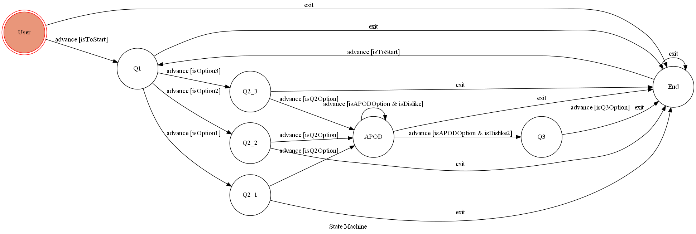

# AstroPsycho

## 簡介

某天上課問同學：「我要做一個Line bot，然後我想去介接NASA的API，因為那很酷，可是我不知道要做什麼應用，誰會想知道今天太陽風的強度？」

帶著眼鏡的同學回答：「不然做天氣預報咧？氣象局也有提供API啊，至少很實用。」

「我有想過，但那太普通了，而且一定會被拿來跟現成的預報機器人做比較。」我回。

這時有位長頭髮的女同學加入話題：「不然做Vtuber啊，你不是很喜歡看，寫一個推薦機器人呢？」

我不太情願的說道：「是可以啦，只是我真的很想用NASA的API，你看這個可以即時看到好奇號拍到的火星影像耶！」

兩位同學抿著嘴沉默了，好吧，看起來這個提案真的很無聊。

「啊！要不然」帶眼鏡的同學突發奇想「你就寫一個天氣預報，然後也可以預報太空天氣，當使用者發現天氣不好很鬱悶時，你就推薦個Vtuber給他看嘛！」

「好喔，你好棒」我都忘了戴眼鏡的同學是幹話王。

「不對，等等，好像不錯喔，我可以在前面先假裝是一個認真的應用程式，然後不管使用者回答什麼我都給他NASA的圖片，最後不知怎麼的再推薦一個Vtuber。這樣子怎麼樣？」

我這麼認真的考慮幹話讓他們兩個都很驚訝。

「欸不是，你真的要做喔？」帶眼鏡的同學對於自己的胡言亂語被採用感到很錯愕。

「做，都做，反正我原本也不曉得要做什麼。」

於是這個作品就誕生了。

## Setup

### Environment
* Windows 10
* Python 3.7
* Pipenv
* Conda
* Heroku

#### Install Dependency
In virtual environment,
```
pipenv install
```
Or in global environment,
```
pip install -r requirements.txt
```

pygraphviz可能會安裝失敗，這時可以用conda來裝裝看，並且可能會需要再安裝額外的Visual C++套件(Windows使用者)
```
conda install graphviz pygraphviz -c alubbock
```
其他系統使用者可參考
* pygraphviz (For visualizing Finite State Machine)
    * [Setup pygraphviz on Ubuntu](http://www.jianshu.com/p/a3da7ecc5303)
	* [Note: macOS Install error](https://github.com/pygraphviz/pygraphviz/issues/100)

#### Secret Data
需要三個金鑰，需到LINE Developer及NASA官網申請，申請完後自行填入``.env``檔內，範例如下
```
LINE_CHANNEL_SECRET={YOUR_CHANNEL_SECRET}
LINE_CHANNEL_ACCESS_TOKEN={YOUR_CHANNEL_ACCESS_TOKEN}
APOD_API_KEY={YOUR_NASA_API_KEY}
```

#### Run On Heroku

由於我無法解決pygraphviz在heroku不能使用的問題，因此又開了一個branch ``deploy``，此分支可隨時push到Heroku上執行。

另外金鑰的部分不能使用.env，需要自行至Heroku網站手動填入環境變數，或使用heroku CLI
```
heroku config:set SOME_KEY={YOUR_KEY}
```

## Develop

#### app.py

伺服器進入點，共有三個route,
1. /webhook：webhook掛載點，在Line Developer網頁中為機器人設定的Webhook URL必須接到此route
2. /show-fsm：會回傳/img中的fsm.png
3. /callback：目前沒有用

#### fsm.py

- _class_ AstroMindMachine
    - 在master branch中繼承transitions.extensions.GraphMachine；在deploy branch中繼承transitions.Machine
    - 用以控制狀態機
- _function_ FSMInitialize
    - 將AstroMindMachine類別instantiate的函式
    - return: AstroMindMachine()
- _class_ Lru_queue
    - 管理使用者上限，並且可讓多個使用者同時執行各自的狀態機
    - 採用Least Recently Used(LRU)策略來剔除多餘的使用者
    - 預設上限為50人

#### utils.py

各種Linebot的API呼叫，以及一些從硬碟讀取資料的函式。

#### scenario.json

所有機器人對答的腳本。因為開發時採取控制和文案分開開發，以方便管理，故出現此檔案。

#### yt_channel.json

Vtuber的頻道連結資料庫。雖然說式資料庫，但其實是用json格式儲存，不過反正資料量不大，用json比較好管理。

## Usage
#### Bot資訊
- Line ID: @021eqist
- QR code:  


#### 狀態
:::info
此Linebot最多可以同時服務50個用戶，彼此之間不受干擾。
:::
- 第一次使用機器人的使用者會被告知有哪些指令，所有指令皆為中文，此時處於初始狀態`user`
    - 輸入
        - 開始：前進至`Q1`
        - 離開：無論處於任何狀態都會前進到`End`
        - 上帝視角：無論處於任何狀態都會回傳FSM的圖
- `Q1`跳出按鈕選單供使用者選擇，除了前面提到的指令外，其餘的輸入都不會有任何動作，往後的狀態亦同
    - 輸入
        - 選項1：前進至`Q2_1`
        - 選項2：前進至`Q2_2`
        - 選項3：前進至`Q2_3`
- `Q2_x`跳出按鈕選單供使用者選擇，所有為`Q2_x`的狀態其選單的文字和選項皆相同，將狀態分開只是為了要記錄使用者在`Q1`的回答
    - 輸入
        - 選項1：前進至`APOD`
        - 選項2：前進至`APOD`
        - 選項3：前進至`APOD`
    - 回復
        - 由Q1的3種選項搭配Q2的3種選項，總共會有9種不同的回復
- `APOD`跳出一張圖片，及圖片的相關訊息文字，最後詢問使用者意見
    - 輸入
        - 選項1：表示使用者不喜歡這張圖，會將系統內部的計數器`date_offset`加一，再次進入`APOD`
        - 選項2：表示使用者仍舊不喜歡這張圖，前進至`Q3`
    - 回復
        - 若選則選項1，會讓下次進入APOD時的圖片是前一天的圖片，重複選擇選項1就會不斷回溯天數
        - 若選則選項2，會回傳對答文字
- `Q3`跳出Image Carousal，使用者要選擇一張圖片
    - 輸入
        - 第1張圖：隨機給予資料庫內所有對應的Youtube連結，前進至`End`
        - 第2張圖 ~ 第5張圖：同上
    - 回復
        - 資料庫內目前有彩虹社、Hololive、AniMare、NoriPro、Voms五種類別，會根據使用者選擇的圖片回傳所對應類別下的隨機一個Youtube連結
- `End`跳出結束的提醒文字，並再次提醒使用者可使用的指令
    - 輸入
        - 開始：前進`Q1`

## Finite State Machine


## Demo


## Reference

[TOC-Project-2019](https://github.com/winonecheng/TOC-Project-2019)  
[TOC-Project-2020](https://docs.google.com/presentation/d/e/2PACX-1vThBHTe2iRVzvead5tBeqnshkhmE61j13rMOs8iwzGgodWheJNlOntg7hXuSlMEY-Ek1l7XA1rzM-xK/pub?start=false&loop=false&delayms=3000&slide=id.g25a54d5e5a4faf37_26)  
[Line line-bot-sdk-python](https://github.com/line/line-bot-sdk-python/tree/master/examples/flask-echo)
